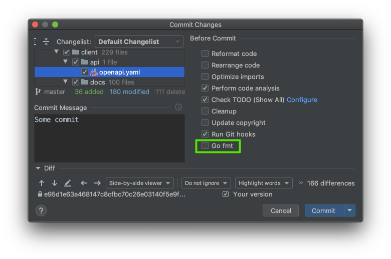

# Insolar Explorer API specifications and codegen

This repository contains API specifications and codegen for Insolar Explorer.

Latest tagged images:
- public `docker run -d -p "80:80" registry.insolar.io/spec-insolar-block-explorer-v1-openapi:latest`

## How to use codegen

Just add it as a Go module to your project—specify some tag as a Go dependency.

## How to contribute to a spec

1. Install all the prerequisites:

    - Go 1.12
    - Docker 
    - Make

2. **Run `make hook` just once**.

This command prepares your local Git pre-commit hook.

Every time you commit changes to a specification, the hook automatically:

1. Rebuilds corresponding Go modules.
2. Puts them next to the specification.
3. Adds the generated files to your commit.

Thus, we gain a single point of truth for our documentation, implementation code, and test code.

You cannot commit if the hook didn't generate the module successfully.

If you are using a JetBrains IDE (GoLand or similar), disable `gofmt` to commit.  

## How to build manually
You can build all clients and servers manually. Just run `make <command>`:

    build-clients                  build all clients
    build-external-call-api-client build only client of external-call-api
    build-external-call-api-server build only server of external-call-api
    build-heavy-replica-api-client build only client of heavy-replica-api
    build-heavy-replica-api-server build only server of heavy-replica-api
    build-servers                  build all servers
    build                          build all modules
    help                           display help screen
    hook                           add pre-commit git hook file
    open                           open all index.html files

## How to release a new version of specs and codegen

Just add a new tag.

CI automatically:

1. Starts a job described in `.github/workflows/` that prepares a docker container with API documentation in an HTML file.
2. Pushes the container to our internal docker registry.

You can verify the container:

 1. Run `docker run -it -p 8080:80  registry.insolar.io/spec-insolar-block-explorer-api-<spec-directory>:<last-tag>`.
 2. Open `http://localhost:8080/` in your browser.

## Directories

- `.github` — contains actions for GitHub.
- `.indirect` — some scripts for the project.
- `external-call-api`, `internal-call-api`, `heavy-replica-api`, `node-join-api` — main folders by service 
    - `client`    — client generated from OpenAPI.
    - `server`    - server generated from OpenAPI.
    - `html`      - generated OpenAPI documentation.
    - `openapi`   - specification sources.
    - `indirect`  - some service-specific scripts.

## FAQ

## What is a pre-commit hook?

Git hooks are scripts that Git executes before or after events such as: commit, push, and receive. 
Git hooks are a built-in feature — no need to download anything. Git hooks are run locally.
Pre-commit starts before finishing your commit in Git.

## How do git hooks work?
Every Git repository has a `.git/hooks` folder with a script for each hook you can bind to. 

## What does my `make hook` do exactly?
The `make hook` command creates `.git/hooks/pre-commit` and makes it call `.indirect/pre-commit.sh`.
The latter script, in turn:

1. Detects directories with the `openapi` name.
2. If the content in at least one changed, the hook generates clients, servers, documentations and appends that to your commit. 
